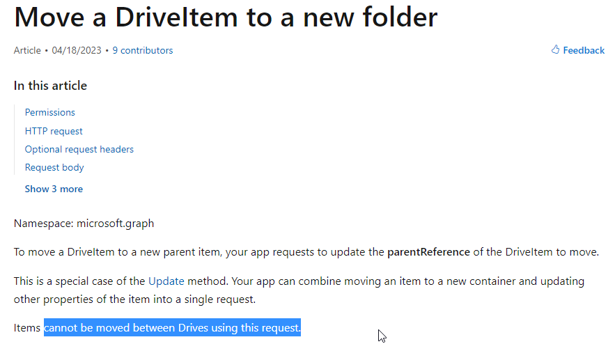
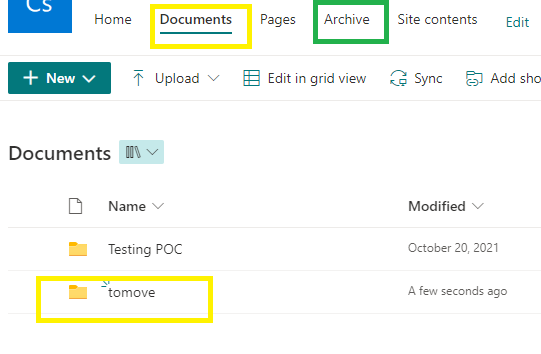
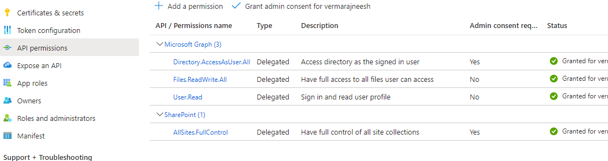

# Demos how drive item can be moved between SharePoint Drives using Graph API via GraphSDK for .Net
This is to show some fun in Graph API. Readers are allowed to decide its fun or lack of quality after testing.

# Requirement
Move a folder from one SharePoint drive to another drive in same site.

> The id of folder should not change.

# Current state
As of this commit, the documentation of Graph API says the [Patch on drive item cannot be used to move between drives](https://learn.microsoft.com/en-us/graph/api/driveitem-move?view=graph-rest-1.0&tabs=http). 


But it is working!!!

Often times the code and documentation will not be in sync. There are chances that the check is not implemented by API by relying solely on documentation and assuming users will not misuse.

> When tried in different environments, it failed when moving folder with large sized files in it. The exception was item not found. But behind the scene it really worked.

> :warning: Be cautious with undocumented features as Microsoft themselves cannot help, if we get stuck in production.

:white_check_mark: Workaround is to use the equivalent CSOM SharePoint APIs via [PnP SDKs](https://github.com/pnp/pnpcore).

# What is the hack

Just add the drive id to the patch request.

## Request as per documentation

PATCH /me/drive/items/{item-id}

Content-type: application/json

```javascript
{
	"parentReference":
	{
		"id":"<new-parent-folder-id>"
	},
	"name":"",
	
}
```
## Request with drive id
The undocumented request payload

PATCH /me/drive/items/{item-id}

Content-type: application/json

```javascript
{
	"parentReference":
	{
		"id":"<new-parent-folder-id>",
		"driveId":"<destination drive id>"
	},
	"name":"",
}

```

# How to run
- Prepare SharePoint site
	- Create SharePoint Online tenant
	- Create user who has permission to the root site
	- Make sure the root site has 'Documents' and 'Archive' document libraries. Also referred as Drives
	- In the 'Documents' drive create a folder called 'tomove'. 
		- This folder will be moved to 'Archive' drive when program run

- Azure portal
	- Create Azure AD app registration and obtain the id. This needs to be replaced for the ClientId's value in appsettings.json
	- Provide the app registration required API Permissions. Screenshot from working environment below.

- Application
	- Clone the repo
	- Replace the values in the appsettings.json
	- Run the console application. (Test application is yet to be done.)

# Specifications

- .Net version - .Net 6
- Nugets referenced
	- Microsoft.Graph : v5.x (Code not compatible with v4.x)
	- DotNet.Helpers
	- easyconsolestd
	- Microsoft.Extensions.Hosting

# On the internet

Click on the below image for the video.
[](https://youtu.be/oYMhZPPsIFM)

# Dependency injection

- Supported. Refer the [Program.cs](/src/Program.cs) file for more details
- The options are injected as dependency to the [MenuService](/src/MenuService.cs then those are invoked based on selection. 
